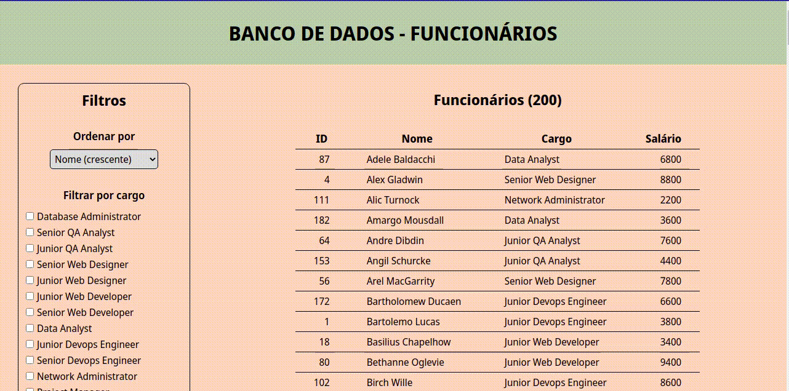

### Informações Gerais

Projeto desenvolvido durante Bootcamp Desenvolvedor Tech Pan oferecido pela IGTI.

---

# Boas vindas ao repositório do projeto Funcionarios!

Neste projeto foi feita uma aplicação para acessar um banco de dados contendo informações de funcionários e realizar filtros de busca.

Lembrando que esta aplicação corresponde aos meus esforços para melhorar minhas hard skills e soft skills, sinta-se à vontade para explorá-la! Feedbacks construtivos são sempre bem vindos!

Abaixo você poderá encontrar mais informações técnicas sobre este projeto.

---

# Sumário

- [Habilidades](#habilidades)
- [Intruções para fazer o fork do repositório](#intruções-para-fazer-o-fork-do-repositório)
- [Informações do projeto](#informações-do-projeto)
  - [Linter](#linter)
  - [Funcionamento da aplicação](#funcionamento-da-aplicação)

---

# Habilidades

Nesse projeto, fui capaz de exercitas os seguintes conceitos:  

- Programação em JavaScript
- Interação com o DOM
- Manipulação de arrays
- Requisições HTTP
- Estilização com CSS

---

# Instruções para fazer o fork do repositório

1. Faça o fork do repositório

2. Instale as dependências do projeto
  * Instale as dependências:
    * `npm install`

3. Iniciar o backend
  * `npm start`

---

# Informações do projeto

### Linter

Para garantir a qualidade do código de forma a tê-lo mais legível, de mais fácil manutenção e seguindo as boas práticas de desenvolvimento foi utilizado neste projeto o linter `ESLint`.

### Funcionamento da aplicação

O backend utilizado pela aplicação está disponível somente neste projeto, portanto para acessá-lo é preciso utilizar a aplicação localmente, após isto no diretório do projeto teremos acesso aos endpoints necessários após utilizar o comando npm start.

A aplicação corresponde em exibir uma lista de funcionários com seus respectivos id's, cargo e salário e por meio de filtros de busca é possível procurar por funcionários ocupantes de cargos específicos ou ainda ordenar os resultados pelo sobrenome ou pelo salário.

---